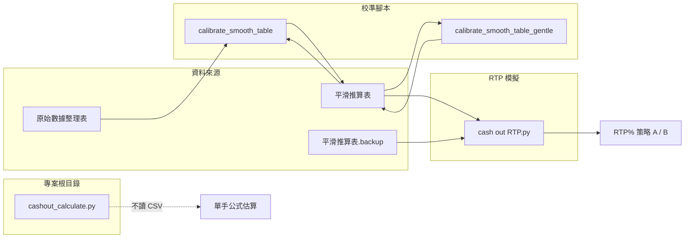

# Cash Out 資料夾邏輯說明

本資料夾為 **Infinite Blackjack** 兌現表與 RTP 校準相關程式與資料，包含對照表 CSV、RTP 模擬、以及兩種校準方式。

---

## 1. 資料夾結構與檔案職責

```
cash out/
├── README.md                          # 本說明文件
├── cash out RTP.py                    # RTP 模擬主程式
├── calibrate_smooth_table.py          # 校準：僅補「-」格
├── calibrate_smooth_table_gentle.py   # 校準：整表等比縮放
└── data/
    ├── blackjack 對照表 - 原始數據整理表.csv   # 原始數據，缺漏以「-」表示
    ├── blackjack 對照表 - 平滑推算表.csv       # 實際用於模擬的兌現表（校準輸出寫入此檔）
    └── blackjack 對照表 - 平滑推算表.backup.csv # 校準前自動備份
```

| 檔案 | 職責 |
|------|------|
| **cash out RTP.py** | 載入對照表、模擬 8 副牌 Blackjack、跑策略 A/B、輸出 RTP%。主程式會載入平滑表與 backup 表各跑一輪並列總覽。 |
| **calibrate_smooth_table.py** | 僅對「原始數據表中為 `-`」的格子加上常數 δ，使 RTP 逼近 96.80%，其餘格子不變。 |
| **calibrate_smooth_table_gentle.py** | 整張表等比縮放 `V' = V × scale`，限制 [40, 177]，以二分搜尋 scale 使 RTP 逼近 96.80%。 |

專案根目錄的 **cashout_calculate.py** 為獨立公式計算：以硬牌/軟牌三次多項式回歸估算單手兌現金額，**不讀取任何 CSV**，用途為單手快速估算，與本資料夾的對照表模擬彼此獨立。

---

## 2. CSV 對照表格式

單一 CSV 內含三個區塊，以 `skiprows` / `nrows` 讀取：

| 區塊 | 讀取方式 | 列 | 欄 |
|------|----------|-----|-----|
| **硬牌** | `skiprows=1, nrows=15` | 玩家點數 4～20（及標題列） | 莊家明牌 2, 3, …, 10, A(11) |
| **軟牌** | `skiprows=19, nrows=9` | 如 `"20 (A,9)"`、`"12 (A,A)"` 等 | 同上 |
| **分牌** | `skiprows=32, nrows=12` | 分牌後點數 5～16 等 | 同上 |

- 欄位在程式中會正規化：`A (11)` / `A` → `11`，其餘為整數 2～10。
- 儲存格數值為 **每 100 元注金的兌現金額**；實際金額公式：
  - `實際兌現 = 表值 × (base_bet / 100)`
- 例如 base_bet=100、表值 177 → 兌現 177 元（1.77 倍）。

---

## 3. 遊戲規則與兌現條件

（依 `cash out RTP.py` 實作）

- **牌靴**：8 副牌，低於 52 張時重新洗牌。
- **莊家**：Soft 17 停牌（Stands on Soft 17）。
- **Blackjack**：玩家 BJ 時先檢查莊家是否 BJ；莊家也 BJ 則 Push（退本金），否則玩家 3:2（含本金共 2.5×base_bet）。

**可兌現條件**（滿足任一即可兌現）：

- 硬牌點數 **< 17**，或  
- **軟牌**（手牌含 A 且以 11 計不爆牌），或  
- **對子**（兩張同點數）。

**不可兌現**：硬 17 以上且非對子 → 不給兌現，強制停牌與莊家比大小。

**查表失敗**（列/欄不存在或型別錯誤）：保守回傳 `base_bet × 0.8`。

---

## 4. 策略 A 與策略 B

| 策略 | 說明 |
|------|------|
| **策略 A** | 第一次可兌現就兌現；對子 **不分牌**，直接依對照表兌現。 |
| **策略 B** | 若起手為對子則 **分牌**，兩手各補一張；之後每手「可兌現就兌現、否則與莊家比牌」。分牌後再成對仍可兌現，不再分牌。 |

RTP 模擬會分別對同一張對照表跑策略 A 與策略 B，輸出兩組 RTP%。

---

## 5. RTP 模擬流程

- **load_cashout_tables(csv_path)**  
  讀取 CSV 三個區塊，正規化欄位後回傳  
  `{"hard": df, "soft": df, "split": df}`。

- **play_round(shoe, tables)**  
  策略 A 單局：發牌 → 判斷 BJ/兌現/比牌，回傳 `(拿回金額, cashout_key 或 None)`。  
  `cashout_key` 為 `(區塊, 列, 欄)`，供校準腳本統計命中「-」格用。

- **_play_round_strategy_b(shoe, tables)**  
  策略 B 單局：對子則分牌，兩手各用 `_resolve_single_hand` 兌現或比牌，回傳 `(拿回金額, 該局總下注)`。

- **run_simulation(tables, n_rounds, seed, strategy)**  
  跑 `n_rounds` 局，回傳 `(總拿回金額, 總下注金額, RTP%)`。  
  可供校準腳本傳入修改後的 `tables` 取得 RTP。

- **run_rtp_for_table(tables, table_label, n_rounds)**  
  對同一張表依序跑策略 A、策略 B，印出兩組 RTP 與總覽，回傳 `(rtp_a, rtp_b)`。

主程式流程：載入平滑表 → 跑 `run_rtp_for_table`（平滑表）→ 若存在 backup 表再跑一次 → 印出 RTP 總覽表。

---

## 6. 校準邏輯

### 6.1 calibrate_smooth_table.py（僅補「-」格）

- **資料來源**：`blackjack 對照表 - 原始數據整理表.csv` 用來建立「-」遮罩；`blackjack 對照表 - 平滑推算表.csv` 為目前平滑表。
- **調整對象**：僅「原始表該格為 `-`」的格子。
- **公式**：`新值 = 原值 + δ`，再限制在 [50, 200]。
- **目標 RTP**：96.80%。
- **流程**：
  1. 載入原始表與平滑表，建立「-」遮罩。
  2. 用當前平滑表跑模擬（策略 A），估計當前 RTP 與兌現時命中「-」格的機率 `p_filled`。
  3. 若 `p_filled` 過低則不調整；否則  
     `δ = (TARGET_RTP - current_rtp) / p_filled`，並限制 δ 在 [0, 80]。
  4. 僅對「-」格加上 δ，寫回平滑表，並先備份至 `平滑推算表.backup.csv`。

環境變數：`CALIBRATION_ROUNDS` 可覆寫校準用模擬局數（預設 500000）。

### 6.2 calibrate_smooth_table_gentle.py（整表等比縮放）

- **公式**：`V' = V × scale`，再限制在 [40, 177]（對應官方 0.4～1.77 倍，主注 100）。
- **目標 RTP**：96.80%。
- **流程**：
  1. 載入當前平滑表，估計當前 RTP。
  2. 以 `scale` 二分搜尋（約在 0.5～2.0 之間），使 RTP 逼近目標；同分時偏好 RTP ≤ 目標。
  3. 寫入最佳表格至平滑表，並備份原表。
- **選配**：設環境變數 `DO_FINAL_VERIFY=1` 會做大樣本驗證，若 RTP 略高可再微調 scale 略降。

環境變數：`CALIBRATION_ROUNDS`（預設 5000000）、`DO_FINAL_VERIFY`。

---

## 7. 資料流概覽



- 實線：讀取/寫入 CSV 或呼叫 RTP 模組。
- 虛線：`cashout_calculate.py` 不依賴本資料夾任何 CSV。

---

## 8. 使用建議

1. **驗證 RTP**：校準後執行 `cash out RTP.py`，以大量局數（如 1e7）驗證策略 A/B 的 RTP。
2. **校準選擇**：  
   - 只想填補缺漏且不更動已有數字 → 用 `calibrate_smooth_table.py`。  
   - 接受整表等比縮放以達目標 RTP → 用 `calibrate_smooth_table_gentle.py`。
3. **單手快速估價**：使用專案根目錄的 `cashout_calculate.py`，不需載入對照表。
